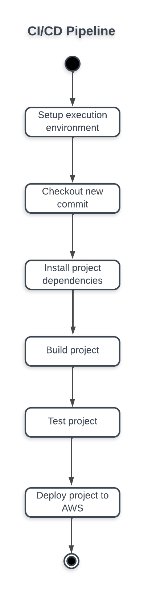

# Pipeline Description

Below is a diagram to explain the CI/CD pipeline process for the StoreFront full stack application.

Setting up the execution environment includes:
- Installing AWS CLI.
- Installing Node.js.
- Installing Chrome browser for the frontend application.
- Installing EB CLI for the backend application.
- Setting up postgresql test database for the backend application.

The deployment process:
- The frontend application will be deployed to AWS S3 bucket.
- The backend application will be deployed to AWS Elastic Beanstalk.