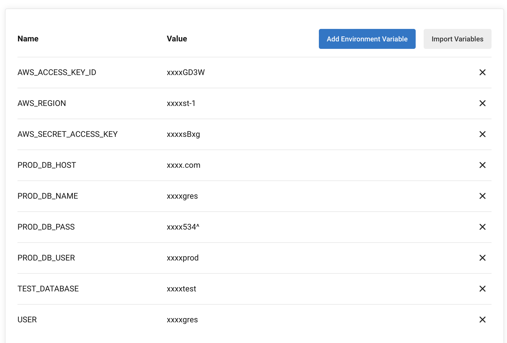

# Hosting-StoreFront-Full-Stack-Application

## Table of Contents

- [Description](#Description)
- [Screenshots](#Screenshots)
- [References](#References)

## Description
This is a full stack application written in TypeScript to serve a small E-commerce prototype. It allows users to create an account, view products and view cart. Users can also add products to their cart and checkout. The application is hosted on AWS and accessible [here](http://store-front-frontend-production.s3-website-us-east-1.amazonaws.com).

The full stack application is split into two repositories (Frontend and Backend). Each with their own CI/CD pipeline and configuration (E.x: package.json).

## Screenshots

- Running S3 Bucket:

- ٍRunning EB Environment:

- Running RDS Database:

- Frontend CI/CD Pipeline:

- Backend CI/CD Pipeline:

- CircleCI Environment Variables:

## References

[Documentation](./Documentation)

[Configurations files](./Configurations)

[Frontend Repository](https://github.com/AbdulazizAlrabiah/Storefront-Frontend)

[Backend Repository](https://github.com/AbdulazizAlrabiah/Storefront-Backend)